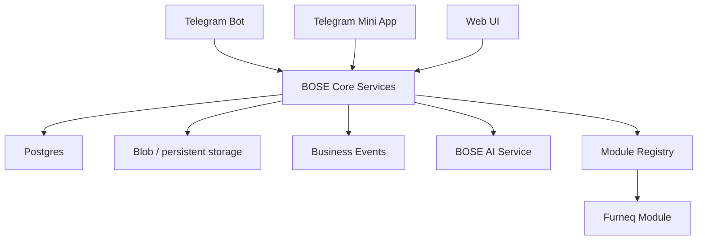

# BOSE Architecture

## Overview

BOSE RC1 keeps the existing working product alive while turning it into a reusable Telegram-first business operating system.

## Core layers

### `lib/core`

- domain map
- unified roles
- lead to client/deal transition
- business event foundation
- core read models

### `lib/telegram`

- Mini App auth verification
- Telegram-first identity seam

### `lib/ai`

- unified AI service
- AI Sales Assistant
- AI CRM Assistant
- shared OpenAI access pattern and fallback behavior

### `lib/modules`

- module registry
- Furneq manifest

### `lib/server-data.js`

Current orchestration layer that still powers legacy and BOSE read paths side by side.

## Data model

### Core entities

- `companies`
- `users`
- `roles`
- `user_roles`
- `leads`
- `clients`
- `deals`
- `tasks`
- `lead_followups`
- `appointments`
- `lead_conversations`
- `lead_messages`
- `business_events`
- `miniapp_sessions`

### Runtime state

- Telegram subscribers
- Telegram client leads
- Telegram registration state
- Telegram dispatch log
- Telegram update offsets
- pilot / launch / success runtime records

### Module-specific

Furneq still extends BOSE through lead context, appointments, files, estimates, production and installation flows.

## Compatibility model

RC1 still preserves the legacy lead-centric contract:

- old lead routes stay alive
- Telegram flows stay alive
- existing UI routes stay alive

New BOSE read paths are layered on top:

- `Client`
- `Deal`
- `BusinessEvent`
- BOSE dashboard summaries
- AI summaries

## Near-term direction

The next safe extraction steps after RC1 are:

1. first-class client and deal detail pages
2. stronger Mini App session mapping
3. typed Furneq projections instead of broad runtime patches
4. notification and event read models with less legacy coupling
